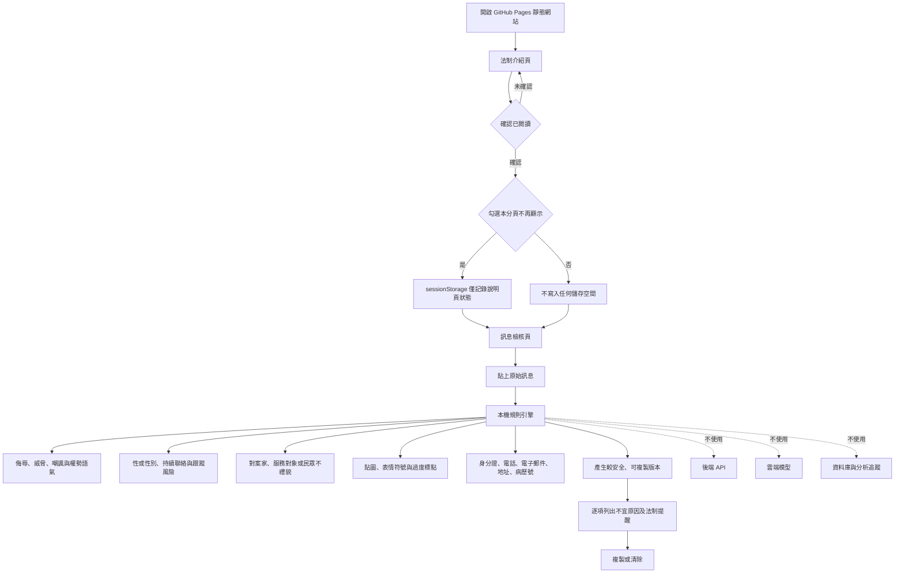

# 系統架構

## 威脅模型與控制

| 風險 | 控制 |
|---|---|
| 訊息內容傳到第三方 | 無後端、無 API，CSP `connect-src 'none'` |
| 瀏覽器持久保存 | 不使用 localStorage、IndexedDB、Cookie；只用 sessionStorage 保存說明頁顯示狀態 |
| 第三方程式庫供應鏈 | 不使用 CDN、字型服務或第三方 JavaScript |
| 網頁追蹤 | 無分析工具、像素、廣告或遠端圖片 |
| 複製後外洩 | 明確提醒共用電腦、剪貼簿同步與雲端剪貼簿風險 |
| 規則誤判為法律結論 | 統一標示為「風險提示」，不輸出違法或成立霸凌的結論 |
| 法規過時 | 首頁與頁尾顯示法規查核日期，官方來源採外部連結 |
