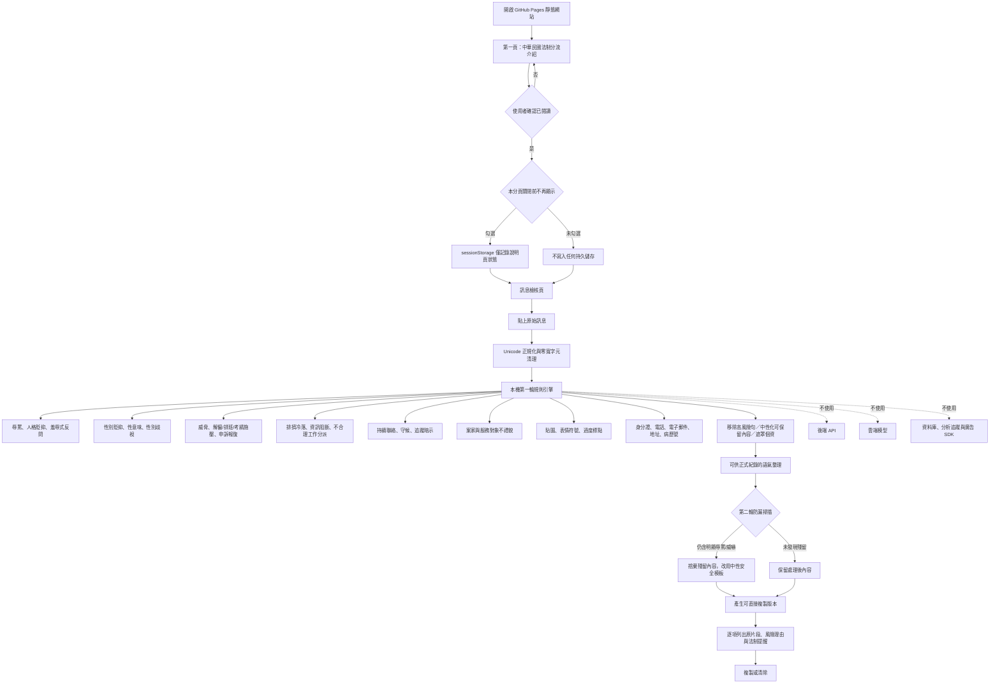

# 系統架構

## 設計原則

第一輪規則負責「辨識與解釋」，第二輪防漏負責「不得把明顯高風險原句重新輸出」。即使第一輪改寫規則有遺漏，只要建議版本仍含明顯辱罵、性別羞辱、威嚇或典型嘲弄，第二輪就捨棄殘留內容並改用中性模板。

風險分數不是違法機率，也不是霸凌成立機率。分數只用於排序傳送前的溝通風險；真正法律判斷仍須看權勢關係、工作必要性、頻率、重大情節、主觀意願、客觀影響與完整證據。

## 威脅模型與控制

| 風險 | 控制 |
|---|---|
| 訊息內容傳到第三方 | 無後端、無 API，CSP `connect-src 'none'` |
| 瀏覽器持久保存 | 不使用 localStorage、IndexedDB、Cookie；只用 sessionStorage 保存說明頁顯示狀態 |
| 第三方程式庫供應鏈 | 不使用 CDN、字型服務或第三方 JavaScript |
| 網頁追蹤 | 無分析工具、像素、廣告或遠端圖片 |
| 規則被空格、全形或零寬字元繞過 | 使用 NFKC 正規化、零寬字元清理及常見拆字變體規則 |
| 第一輪漏掉高風險字句 | 第二輪殘留防漏掃描；命中即改用安全模板 |
| 複製後外洩 | 明確提醒共用電腦、剪貼簿同步與雲端剪貼簿風險 |
| 規則誤判為法律結論 | 統一標示為「風險提示」，不輸出違法或成立霸凌的結論 |
| 法規過時 | 首頁與頁尾顯示法規查核日期，官方來源採外部連結 |
