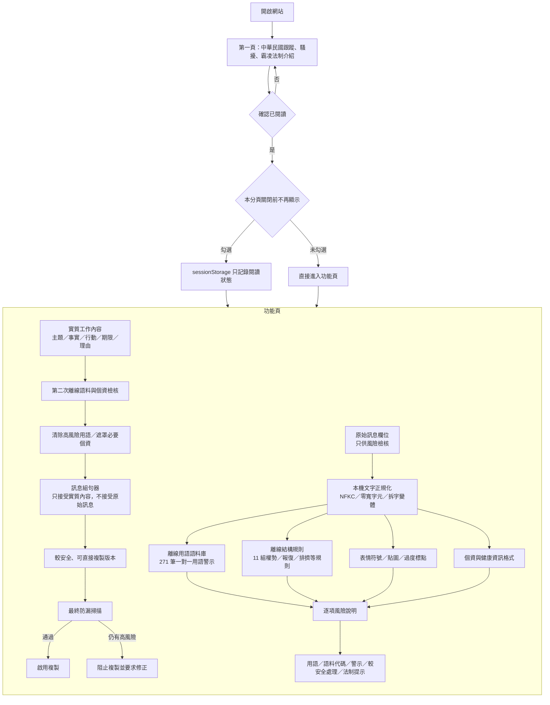

# 系統架構與威脅模型

版本：1.2.0  
設計核心：純前端、零後端、零上傳；原始訊息與可複製輸出完全分流。

## 不變量

1. 原始訊息只進入風險掃描流程，不會進入訊息組句器。
2. `composeSafeMessage()` 沒有原始訊息參數，只能接收使用者另填的實質工作內容。
3. 可複製按鈕只複製建議版本，不複製原始高風險片段或下方風險備註。
4. 實質工作內容本身仍須再掃描一次；若其中帶入辱罵、性意味、威脅、報復、排擠或其他高風險內容，會先清除或阻止輸出。
5. 最終建議版本再做一次防漏掃描；如仍命中高風險內容，直接停用複製。

## 離線語料庫

`risk-corpus.js` 與網站一同部署，不需 API、資料庫伺服器或模型服務。每筆用語紀錄均包含：

- 唯一語料代碼
- 高風險用語
- 風險類別
- 嚴重度與風險權重
- 一對一風險警示
- 較安全處理方式
- 對應法制標籤
- 必要時的對象條件

此外另有結構式規則，用以辨識不能只靠單一詞彙處理的語句，例如申訴報復、人事威嚇、排擠、刻意隱瞞資訊、不合理工作量、揭露申訴資訊、持續通訊干擾與交換式性騷擾等。

## 資訊安全

網站不建立帳號、不傳送文字、不使用 `fetch`、`XMLHttpRequest`、WebSocket、第三方分析工具或雲端模型。CSP 設定 `connect-src 'none'`。原始文字、實質工作內容與分析結果不寫入 localStorage、IndexedDB、Cookie 或檔案；僅使用 `sessionStorage` 記錄「本分頁是否略過法制說明」。

## 綠色資訊設計

分析只在使用者按下檢核按鈕時執行；不常駐背景運算、不下載大型模型、不進行伺服器推論。271 筆用語與 11 組結構規則均為小型本機文字規則，適合 GitHub Pages 靜態部署。
