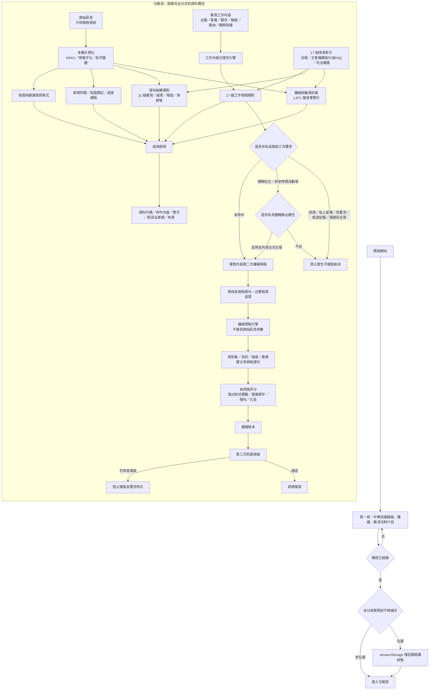

# 系統架構與威脅模型

版本：1.5.0  
最後更新：2026-08-07  
設計核心：純前端、零後端、零上傳；風險檢核、工作合理性與潤稿分成三個獨立層次，原始訊息永遠不是輸出文字來源。

## 核心安全不變量

1. **原始訊息永不進入輸出組句器。** `composeSafeMessage()` 沒有原始訊息參數。
2. **不能把不合理工作要求「禮貌化」後當成安全訊息。** 工作內容合理性引擎在改寫前先判斷要求本身；若屬阻擋型情境，`safeText` 必須為空、`copyable=false`。
3. **「有寫理由」不等於合理。** 「因為我是老闆」、「主管說了算」、「照做就對」等不能解除攔截；需有可辨識的職務、專案、服務、法規、作業程序、安全或其他具體工作依據。
4. **專業敏感術語採情境例外，不採白名單放行。** 例如醫療、法律、教育或研究中確有必要使用性行為術語時，只有在「工作必要性／職務依據」能支持專業目的時，才保留詞彙並顯示情境提醒；一般社交或權勢情境仍攔截。
5. **實質工作內容仍接受第二次掃描。** 使用者不能繞過原始訊息欄位，直接把辱罵、性要求、報復、人事威嚇或不合理要求填進工作欄位。
6. **最終輸出再掃描一次。** 任何殘留的阻擋型內容會停用複製。
7. **複製按鈕只複製建議版本。** 不會複製原始高風險片段、語料命中內容或法律備註。
8. **潤稿不得補造事實。** 候選句只能使用使用者填寫的結構化欄位，不新增日期、人名、制裁、法律結論或工作事實。
9. **職務依據預設不對外輸出。** `basis` 主要供工作合理性與專業必要性判斷，只有使用者明確勾選才寫入建議版本。
10. **安全判斷優先於文筆。** 若工作合理性或最終防漏未通過，即使潤稿候選文字通順，也必須 `copyable=false`。

## 離線語料與規則層

`risk-corpus.js` 與網站一起部署，目前包含：

- 1,871 筆逐筆高風險用語／近義詞／常見變體。
- 11 組語句／上下文結構規則。
- 17 組工作內容合理性規則。
- 17 組來源索引。

每筆詞彙至少包含唯一代碼、風險類別、嚴重度、警示、較安全處理方式、法制標籤與來源代碼。工作情境規則則處理單一關鍵字無法可靠判斷的情況，例如：

- 陪酒、強制飲酒或續攤。
- 私人差事或與職務無合理關聯之要求。
- 社交宴會、餐敘、陪同見面但欠缺工作必要性。
- 下班後無限待命、不得漏接訊息。
- 請假刁難或申訴後不利處分。
- 刻意排除必要會議、資訊或資源。
- 明顯不合理目標、能力不符或資源不足的工作分派。
- 要求偽造、刪改、回填不實紀錄。
- 要求跳過安全程序、資格或必要查核。
- 將女性、年輕女性或特定性別固定分派接待、陪酒、倒酒等角色。
- 權勢關係下的私人房間、旅館或其他高風險私密情境要求。

## 離線潤稿層

`rewrite-engine.js` 不使用原始訊息，而是從主題、事實、行動、期限與原因建立數個候選句。候選句依下列品質訊號排序：

- 是否出現 `說明如下`、`相關原因、影響或程序：` 等欄位模板。
- 是否過度重複「請」「麻煩」。
- 是否有重複句、過多句子或不自然殘句。
- 自然版是否混入不必要的公文化套語。
- 精簡版是否仍過度冗長。

輸出風格分為自然工作訊息、精簡直接及正式書面。這是可審計的規則式語言生成，目的在於比固定模板更自然；不宣稱等同大型語言模型。

## 來源策略

網站不把網路文章全文搬進程式，也不把單一裁判當成通案法律結論。來源採下列優先序：

1. 中華民國現行法規與主管機關法令系統。
2. 勞動部、職業安全衛生署、保訓會等主管機關指引與FAQ。
3. 司法院公開判決說明、司法新聞與公開裁判資料。
4. 裁判書鏡像僅作為補充檢索來源，網站會明示其層級。

語料是從上述來源抽象化出的「風險詞彙／情境」，並在 1.4.0 以語意近義、臺灣常見口語、委婉代稱與常見變體擴充，不是把判決事實逐字複製成黑名單。這可降低過度擬合單一案件，也保留法律上必須整體審酌背景、頻率、權勢、必要性及影響的空間。

## 資訊安全與綠色資訊設計

- 無後端、無帳號、無API、無雲端模型、無第三方分析追蹤。
- CSP 使用 `connect-src 'none'`，網站程式不能以 fetch、XHR、WebSocket 對外傳輸使用者內容。
- 原始訊息、實質內容與分析結果不寫入 localStorage、IndexedDB、Cookie 或檔案。
- 僅以 sessionStorage 記錄「本分頁是否略過法制說明」，關閉分頁即失效。
- 分析只在使用者主動按下檢核時執行，不下載大型模型、不持續背景推論。
