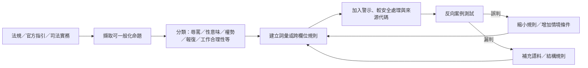

# 離線語料庫建構與來源方法

版本：1.6.0  
最後更新：2026-08-07

## 目的

`risk-corpus.js` 不是一般髒話字典，而是供「送出訊息前」與「下達工作要求前」使用的離線風險資料層。它要回答三個不同問題：

1. 這段文字有沒有明顯辱罵、威脅、性意味、性別貶抑、報復、個資等風險？
2. 即使沒有髒話，整個語句結構是否呈現權勢壓迫、排擠、報復或持續干擾？
3. 即使語氣很客氣，工作要求本身是否可能欠缺業務必要性、涉及不合理工作、私人要求、性要求、偽造紀錄或安全違規？

因此 1.6.0 採多層結構：1,871 筆詞彙／近義詞／常見變體、既有語句結構規則、1,349 筆完整案例相似語料、語言學結構規則，以及工作情境與工作要求阻擋規則。

## 1.6.0 完整案例語料

使用者提供三份大型案例資料，內容涵蓋人格羞辱、職權刁難、冷暴力、性騷擾、心理操控、職涯威脅、數位騷擾、孕產與身心狀況歧視等。建置時先將編號、引號與說明文字分離，再依內容分類、繁體中文正規化及去重，形成 1,349 筆可由程式直接讀取的完整案例。

完整案例不是「命中即違法」清單。它的作用是補捉同義改寫、詞序變化與較長語句中仍然相似的羞辱／權勢結構。系統採字元二元與三元片段重疊、包含率、長度比與最低門檻計算，只在達到門檻且具有風險錨點時加入提示。

為避免單純相似度造成過度判定，完整案例層必須和詞彙、語言學結構、工作情境及人工判斷共同使用；一般合理的期限、修正要求與工作標準另有反向案例測試。

## 來源分級

### 第一級：現行法規與主管機關法令系統

優先作為規則邊界與法律標籤來源，例如：

- 職業安全衛生法第22條之1。
- 職場霸凌防治措施準則第2、20、27條。
- 性別平等工作法第12條。
- 工作場所性騷擾防治措施準則。
- 勞動條件、工時與休息相關法規。

### 第二級：主管機關指引與FAQ

用來補足法律條文沒有列出全部實務語態的問題，例如：

- 勞動部職業安全衛生署《執行職務遭受不法侵害預防指引（第五版）》。
- 勞動部就業平等網「工作場所性騷擾事件如何認定？」。
- 公務人員保障暨培訓委員會職場霸凌調查處理指引。

### 第三級：司法院公開實務

用來辨識「看似普通管理行為，但在權勢與情境下可能高度不當」的模式。目前包含司法院公開的謝曉星、李伯道、施教文等案件說明，抽取的不是當事人姓名或完整案情，而是可一般化的風險模式，例如：

- 多次公開粗話責罵。
- 性別刻板工作角色分派。
- 對特定性別施加額外請假程序。
- 長期要求不得漏接電話／LINE。
- 晚宴後在權勢關係下要求進入私人住宿房間。
- 評論身材、衣著、氣味或其他身體特徵。
- 不當觸摸、擁抱或其他身體接觸。

### 第四級：公開裁判資料鏡像

少數勞動裁判使用公開裁判資料鏡像協助研究搜尋。這類來源只作補充，不高於官方法規、主管機關指引或司法院官方資料；網站來源目錄會明示層級。

## 語料如何形成

### 1.4.0 近義詞擴充原則

新增詞彙以既有法制與風險類別為母類，不因模型想到某個詞就直接列入。擴充層次包括直接近義詞、臺灣常見口語或俗語、性／身體用語的委婉代稱、常見網路變體，以及管理工作中常見的同義改寫。高度多義的日常中性詞原則上不單獨列入，而採較完整短語，以降低誤判。新增工作內容近義詞若涉及不合理分派、不實記載、安全規避、強迫待命、請假不利益、陪酒或申訴報復，也同步擴充 `contextRules` 的阻擋模式。

不採「把判決全文抓下來→切詞→全部列黑名單」的方法，原因有三：

1. 法律判斷高度依賴背景、權勢、頻率、目的與影響，逐字黑名單會造成大量誤判。
2. 判決中的文字可能只是證據敘述，不代表法院認為該詞本身必然違法。
3. 大量複製判決或網站文字也不符合最小化、可維護與著作權風險控制的設計原則。

本專案採「來源→法律／實務命題→抽象風險模式→離線規則」：

## 明確性行為詞彙與專業例外

如「肛交」等詞彙本身在一般主管訊息、社交要求或對部屬的私人邀約中具有高風險，但在下列工作可能是必要術語：

- 醫療衛生教育、病史詢問、感染風險說明。
- 法律案件事實整理或司法文件。
- 性教育、公共衛生研究或學術研究。

因此語料仍會命中，但「工作內容合理性引擎」只有在工作必要性／職務依據明確支持專業目的時，才允許保留在建議版本；這不是把詞彙從資料庫移除。

## 工作必要性不是「主管說了算」

工作依據欄位的目的，是區分：

- 正常專案餐敘 vs. 要求陪酒、續攤。
- 合法值班輪值 vs. 無限下班待命。
- 合理專業敏感用語 vs. 私人性要求。
- 真正職務工作 vs. 主管私人差事。

「因為我是老闆」、「主管要求」、「照做就好」只表示權勢存在，不會被當作解除風險的理由。

## 目前來源目錄

網站內建 17 組來源代碼。完整 URL 與說明直接放在 `risk-corpus.js` 的 `sourceCatalog`，並在功能頁「離線語料庫如何建立」下方可查看。主要來源包括：

- 勞動部｜職業安全衛生法第22條之1。
- 勞動部｜職場霸凌防治措施準則第2、20、27條。
- 勞動部職業安全衛生署｜執行職務遭受不法侵害預防指引（第五版）。
- 勞動部就業平等網｜工作場所性騷擾事件如何認定。
- 勞動部｜性別平等工作法第12條、工作場所性騷擾防治措施準則。
- 司法院｜謝曉星、李伯道、施教文懲戒案件公開判決說明。
- 公務人員保障暨培訓委員會｜公務人員職場霸凌調查處理指引。
- 補充之公開勞動裁判資料。

## 維護規則

新增語料或規則時，至少必須：

1. 有唯一 ID。
2. 有風險類別與嚴重度。
3. 有清楚警示，不使用「命中＝違法」文字。
4. 有較安全處理方式或阻擋策略。
5. 有至少一個有效來源代碼。
6. 若可能出現在正當專業情境，設定情境敏感或專業例外，而不是一律封鎖。
7. 加入正向與反向測試，確認既不漏掉明顯高風險，也不把正常工作內容大量誤判。
